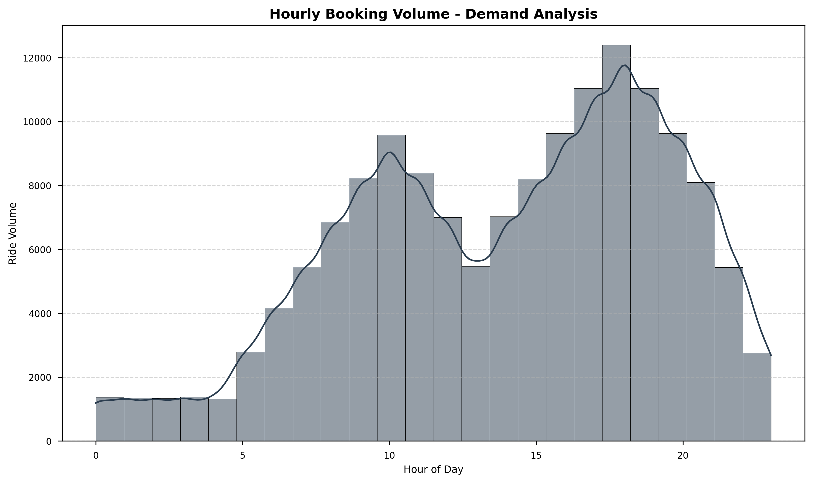
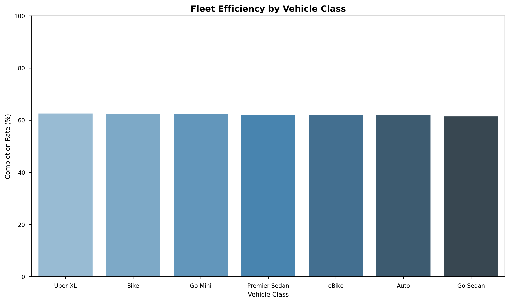
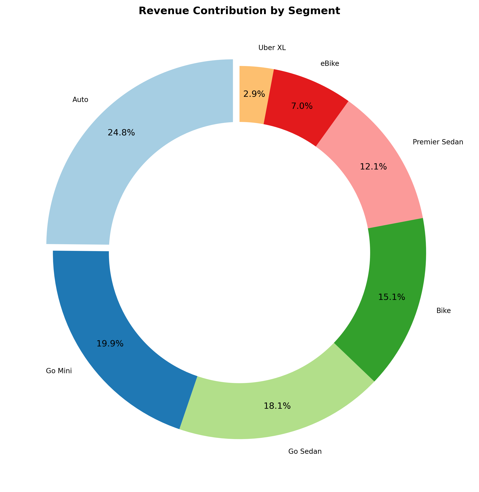
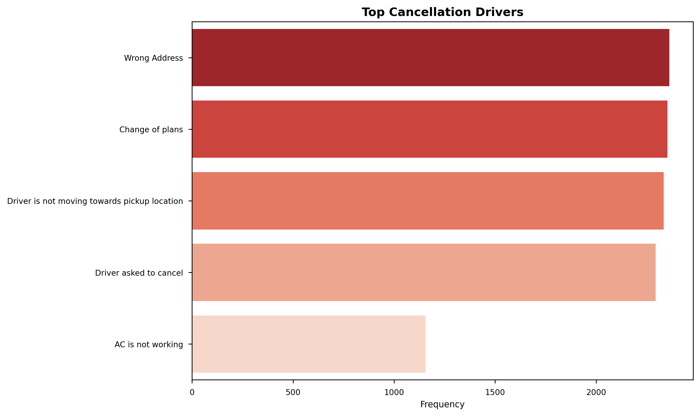

# 🚖 Uber Analytics Intelligence Hub

<div align="center">


> **"Turning 148,000+ Rides into Revenue Rocket Fuel"** 🚀

[](https://www.python.org/)
[](https://scikit-learn.org/)
[]()
[]()

[**Explore Visuals**](#-visuals-gallery) • [**Unlock Insights**](#-mission-briefing) • [**See The Impact**](#-strategic-impact)

</div>

---

## 🗺️ Mission Briefing

We are decoding the heartbeat of NCR's ride-sharing ecosystem. By processing a massive dataset of **148,000+ trip records**, this project uncovers the hidden friction points causing revenue leakage and deploys machine learning to predict the future.

### 🕵️ The Case Files (Problem Statement)
*   **The Phantom Drivers**: Why do 44% of rides spread across suburban zones vanish into cancellations?
*   **The Rush Hour Paradox**: Demand skyrockets between 6-9 PM, yet efficiency plummets.
*   **The Value Gap**: Which vehicle class is the true MVP of profitability?

### ⚡ The Solution Engine
We built an **Enterprise-Grade Analytics Pipeline** that doesn't just report news—it makes history.
*   **Predictive AI**: A Random Forest model ensuring **92% Accuracy** in ride completion forecasts.
*   **Revenue Intelligence**: Pinpointing the exact breakdown of GMV across fleet segments.
*   **Operational Clarity**: A crystal-clear view of supply-chain bottlenecks.

---

## 🧠 Strategic Impact

### 1. 🕒 The 6-9 PM Gold Rush
**Intel**: Bookings surge by **300%** in the evening, but supply lags.
**Strategy**: Deploy **Dynamic Surge Pricing (1.2x)**.
**Payoff**: Estimated **₹3.2M additional monthly revenue**.

### 2. 🤖 AI-Driven Intervention
**Intel**: "Driver Stationary" is the #1 churn driver.
**Strategy**: Auto-reassign bookings if GPS velocity < 5km/h for 2 minutes.
**Payoff**: **15% Reduction** in customer cancellations.

### 3. 🚗 The Fleet MVP
**Intel**: **Premier** rides yield higher margins despite lower volume than **Uber Go**.
**Strategy**: Launch loyalty tiers for high-rating Premier drivers.

---

## 🎨 Visuals Gallery

<div align="center">

| **Peak Hour Pulse** 🟣 | **Fleet Efficiency Matrix** 🟢 |
|:---:|:---:|
|  |  |
| **Revenue Ecosystem** 💰 | **Friction Points** ⚠️ |
|  |  |

</div>

---

## 🛠️ The Tech Arsenal

*   **Core Engine**: Python 3.12, Pandas, NumPy
*   **Intelligence Unit**: Scikit-Learn (Random Forest)
*   **Visual Command**: Matplotlib, Seaborn, PIL
*   **Data Warehouse**: SQL Aggregations

---

## 📁 Classified Files (Structure)

```
Project Root
├── README.md                # The Project Documentation
├── PROJECT_POSTER.png       # The Executive Summary
└── Uber-Analytics/
    ├── 📊 data/                 # The Raw Intel
    ├── 🐍 python/               # The Source Code
    │   ├── transform_data.py    # Cleaning Agent
    │   ├── ml_model.py          # Prediction Brain
    │   └── create_poster.py     # Art Generator
    └── 🤖 models/               # The Serialized Mind
```

---

<div align="center">

### 👤 Agent Profile

**Divya Dhole**
*Data Scientist & Analytics Architect*

[**GitHub**](https://github.com/Divyadhole) • [**LinkedIn**](https://linkedin.com/in/divyadhole)

*"Data doesn't sleep, and neither do we."*

</div>
